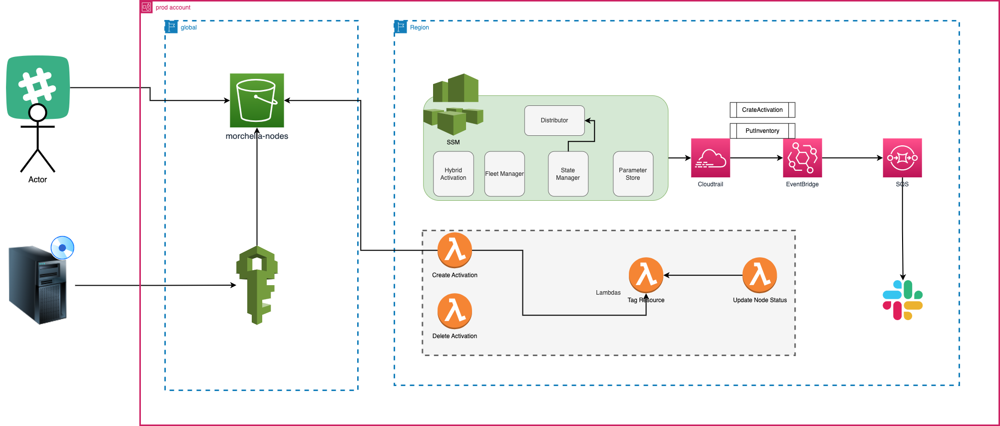

# Morchella

Project to commision and register on-prem/edge servers on AWS Systems Manager (SSM)

## Installing the SSM agent

NOTE: Check [morchella-server-bootstrap](https://github.com/msosas/morchella-server-bootstrap)

## Architecture



## Deploying Morchella infrastructure

1. Set up this project as a Terraform module:
```
module "morchella" {
  source = "https://github.com/msosas/morchella-server-bootstrap.git?ref=master"
}

output "morchella_access_key" {
  value = module.morchella.morchella_access_key
}

output "morchella_secret_key" {
  value     = module.morchella.morchella_secret_key
  sensitive = true
}
```
2. Deploy the module using Terraform
```
terraform init
terraform plan -out=plan
terraform apply plan
```
3. Get the IAM credentials from TF
```
terraform output -json | jq '.["morchella_access_key"]["value"]'
terraform output -json | jq '.["morchella_secret_key"]["value"]'
```

4. Generate the config.ini file using this credentials

```
[CREDENTIALS]
AWS_ACCESS_KEY_ID = AAAABBBBCCCCDDD
AWS_SECRET_ACCESS_KEY = /123456789xzyxxxaxaxa

[SLACK]
SLACK_WEB_HOOK = https://hooks.slack.com/services/ACACACAC/BABABABABA/5465asf6a54sf65465
SLACK_CHANNEL = #general

[MORCHELLA]
AUTO_REGISTER = -y
```

5. Now deploy this application using the Morchella Ansible playbook and pass it the config.ini file before running it

6. Servers should register against AWS using SSM


## Docs

- https://www.amazonaws.cn/en/systems-manager/
- https://docs.aws.amazon.com/systems-manager/latest/userguide/distributor-working-with-packages-create.html#distributor-working-with-packages-create-simple
- https://docs.aws.amazon.com/systems-manager/latest/APIReference/API_UpdateDocument.html#API_UpdateDocument_RequestSyntax
- https://docs.aws.amazon.com/systems-manager/latest/userguide/distributor-working-with-packages-version.html#add-pkg-version-cli

## Price
https://aws.amazon.com/systems-manager/pricing/